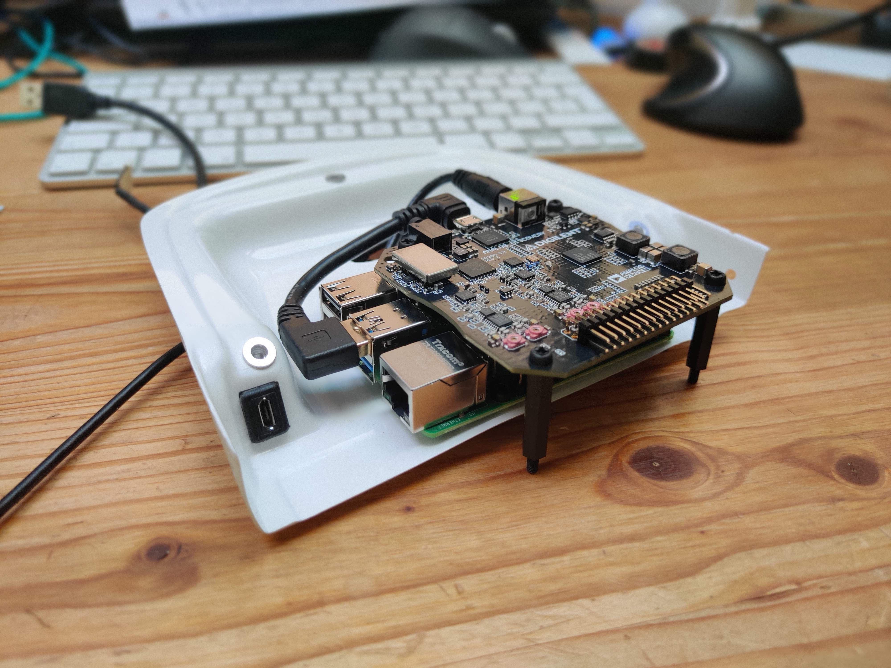

# OsciDAQ
Data Acquisition (DAQ) with the [Analog Discovery 2](https://store.digilentinc.com/analog-discovery-2-100msps-usb-oscilloscope-logic-analyzer-and-variable-power-supply/) oscilloscope. The OsciDAQ was developed as part of an internship at [Wingtra](https://wingtra.com/) by [Jonas Lauener](https://www.jolau.ch/).  

Copyright (c) 2020, Jonas Lauener & Wingtra AG\

## Index
- [Hardware](#hardware)
  * [Capabilities](#capabilities)
  * [Pinout](#pinout)
- [General Workflow](#general-workflow)
- [Acquisition](#acquisition)
  * [Installation](#installation)
  * [Usage](#usage)
    + [Workflow](#workflow)
      - [Before measurement campaign](#before-measurement-campaign)
      - [At measurement campaign](#at-measurement-campaign)
      - [After measurement campaign](#after-measurement-campaign)
    + [Connect to OsciDAQ](#connect-to-oscidaq)
- [Conversion](#conversion)
  * [Installation](#installation-1)
  * [Usage](#usage-1)
    + [Workflow](#workflow-1)
    + [Convert TDMS to CSV](#convert-tdms-to-csv)
    + [Preview TDMS](#preview-tdms)
- [Analysis](#analysis)
  * [Installation](#installation-2)
  * [Usage](#usage-2)
- [Example data](#example-data)

## Hardware
- [Raspberry Pi 4](https://www.raspberrypi.org/products/raspberry-pi-4-model-b/)
- [Analog Discovery 2](https://store.digilentinc.com/analog-discovery-2-100msps-usb-oscilloscope-logic-analyzer-and-variable-power-supply/)
- [Pololu 5V, 5A Step-Down Voltage Regulator](https://www.pololu.com/product/2851/specs) 
    - For better stability the Raspberry and the Analog Discovery have to be powered separately. Otherwise the voltage drop over Raspberry Pi's USB is to large and the connection to the Analog Discovery is unstable (→ ERC 0x2 in Waveforms software).

### Capabilities 
Two-channel oscilloscope:
- 1MΩ
- ±25V
- differential
- 14-bit
- 100Msample/sec
- 30MHz+ bandwidth (with the Analog Discovery BNC Adapter Board)

Other features for data acquisition are not yet supported by this toolchain.

### Pinout

## General Workflow
1. Do the [acquisition](#acquisition) of the data with the official Waveforms software. The data is logged in the proprietary, binary file format [TDMS](https://www.ni.com/en-us/support/documentation/supplemental/06/the-ni-tdms-file-format.html).
2. [Convert](#conversion) the TDMS files to CSV.
3. [Plot and analyze](#analysis) the CSV files.

## Acquisition
The acquisition is done with the official Waveforms software. With the prepared logging script, it records the samples in the TDMS file format.

### Installation
_In case you want to setup your own OsciDAQ on a Raspberry Pi:_ \
Remark: The Analog Discovery 2 works only with the Raspberry Pi 4.

1. Plug the Analog Discovery 2 to a USB 3.0 port on the Raspberry.
2. Install [Adept 2 Runtime](https://mautic.digilentinc.com/adept-runtime-download). Last tested version: 2.20.1 
3. Install latest 32bit [Waveforms beta](https://forum.digilentinc.com/topic/8908-waveforms-beta-download/). Last tested version: 3.13.20 

### Usage

#### Workflow
##### Before measurement campaign
1. Connect oscilloscope to the signals you wish to investigate → [Pinout](#pinout)
2. [Connect to OsciDAQ](#connect-to-oscidaq) and open the template_logging.dwf3work workspace
3. Make your adjustment until you get your signal right
4. _Save as..._ workspace

##### At measurement campaign
1. [Connect to OsciDAQ](#connect-to-oscidaq) and open your prepared workspace
2. Make sure `Each acquisition` is selected in Logging
3. Press `Run`

##### After measurement campaign
1. Download the collected data (by default under `~/Documents/scope`) over SFTP
2. Proceed with [Conversion](#conversion) 

#### Connect to OsciDAQ
1. Connect your laptop to the OsciDAQ by Ethernet. 
2. Find the IP address with `sudo arp-scan --interface=eth0 --localnet`
3. Connect with the [VNC Viewer](https://www.realvnc.com/de/connect/download/viewer/) to the Raspberry Pi.

## Conversion
The binary TDMS files coming from the Waveforms software have to be converted to CSV files - this is done using a custom python script.

### Installation
Install the converter script on your PC:
Run: `pip3 install -r OsciConverter/requirements.txt`

### Usage
#### Workflow
1. Identify the UTC timestamp when the interesting stuff happened
2. Identify which batch folder contains the selected timestamp
3. [Convert the TDMS files to CSV in that batch folder](#convert-tdms-to-csv)

#### Convert TDMS to CSV
Run `python OsciConverter/tdms_convert.py [path to the batch directory with the TDMS files]`

The csv files are stored in a directory named `[tdms_files_directory]_csv` located next to the directory stated above.

Run `python OsciConverter/tdms_convert.py -h` to see all available options.

#### Preview TDMS
Run `python OsciConverter/tdms_preview.py [path to tdms file]` to preview data of one file as a plot.

## Analysis
You can use whatever tool you like to analyze the csv files, but I recommend you to use the [BeSpice Wave software](http://www.analogflavor.com/en/bespice/downloads/).

### Installation
Download and install the [BeSpice Wave software](http://www.analogflavor.com/en/bespice/downloads/) on your PC.

### Usage
Open the previously converted CSV files in BeSpice Wave

## Example data
As a proof-of-concept I did some logging on an I2C port (SDA/SCL):
- [Example TDMS file](docs/acq_0002001_2020-05-12T13_21_35.874.tdms)
- [Corresponding CSV file](docs/acq_0002001_2020-05-12T13_21_35.874.csv)
